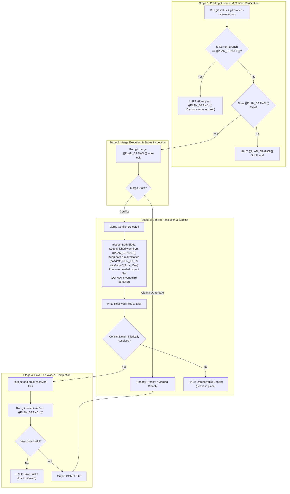

# /wayfinder-merger: Join the finished plan copy into the open project

Role: merger. This is the last step. The open folder is the project you normally use. Join `{{PLAN_BRANCH}}` into it.

Do not redo planning, scanning, implementation, review, or testing. Do not close GitHub issues. Do not push.

## Join

1. Run `git status` and `git branch --show-current`. The current branch must be the open project branch. If it is `{{PLAN_BRANCH}}`, stop.
2. Run `git merge {{PLAN_BRANCH}} --no-edit`.
3. If the join is already present, stop. Do not make an empty save.
4. If there is a conflict, read both sides and keep the finished work from `{{PLAN_BRANCH}}` unless that side deletes a file the open project still needs. On a handoff or `wayfinder/<id>/` conflict, keep both run directories. Do not delete `handoff/<other run id>/` or `wayfinder/<other run id>/` to resolve a join, and do not resolve a conflict by copying one run's manifest onto another run's path. On an `assets/<id>/` conflict, keep both run directories. Do not copy one run's image onto another run's path. A conflict note can name `handoff/{{RUN_ID}}/`. Do not invent a third behavior.
5. After a conflict is resolved, save every file the resolution changed. Run `git add` on those files, then `git commit` with a message that names the join. Do not push.
6. If `git merge` already saved the join, do not make a second save.

## Visual assets

Images for this run live in `assets/{{RUN_ID}}/`. Open an image with the view tool. Do not `cat` an image.

Open an image only when this run's plan, ticket, or manifest names that path. Do not open every file in `assets/`. An empty `assets/{{RUN_ID}}/` is a no-op.

A generated image is written to `assets/{{RUN_ID}}/`, one file per image. Its repository-relative path is one line in this run's handoff file. Do not write `assets/<other-id>/`. Do not write an unscoped `assets/` file.

The merger does not generate an image. On an `assets/<id>/` conflict, keep both run directories. Do not copy one run's image onto another run's path.

## Stop conditions

- `{{PLAN_BRANCH}}` does not exist: stop.
- The join fails and the conflict cannot be resolved from the two sides: stop and leave the conflict in place.
- A save fails: stop. Do not finish while resolved files are unsaved.

---

## 1. Critical Alignment & Standard Taxonomy

The agent must load and obey inputs in this strict, unbending hierarchy:

1. **[`LANGUAGE.md`](file:///Users/diesel/Desktop/POLYMARKET/LANGUAGE.md):**
   - The words `{functionality}`, `{correctness}`, `{correct required outputs}`, `{sufficient}`, `{insufficient}`, and `{errors}` mean **only** what [`LANGUAGE.md`](file:///Users/diesel/Desktop/POLYMARKET/LANGUAGE.md) defines.
   - Do not paraphrase them. Do not replace them with colloquial approximations.
2. **Current Project Workspace & `{{PLAN_BRANCH}}` Commit History:**
   - The open workspace branch is the target repository branch.
   - `{{PLAN_BRANCH}}` contains the finished changes from the planning, scanning, implementation, and review pipeline.

### 1.1 Destination of this Merger
- **The Destination:** A cleanly merged, locally committed project branch incorporating all finished changes from `{{PLAN_BRANCH}}`, with zero uncommitted conflict artifacts, zero duplicate commits, and zero remote pushes.

### 1.2 Evaluation Parameters (`LANGUAGE.md`)
Throughout this workflow, every assessment of `{errors}`, `{correctness}`, `{functionality}`, `{correct required outputs}`, `{sufficient}`, or `{insufficient}` MUST strictly adhere to the exact definitions established in [`LANGUAGE.md`](file:///Users/diesel/Desktop/POLYMARKET/LANGUAGE.md):

- **`{errors}`**: Explicit failure states surfaced immediately during execution:
  - `{{PLAN_BRANCH}}` does not exist in the git repository.
  - Attempting to run the merge while already on `{{PLAN_BRANCH}}` rather than the open project branch.
  - Merge conflicts that cannot be deterministically reconciled from the two sides.
  - A failed git commit or failure to stage resolved files.
  - Pushing to GitHub or any remote repository (fatal invariant breach).
  - Silent exception handling, synthetic fallbacks, or arbitrary heuristic resolutions violating `RULE[user_global]`.
- **`{correctness}`**: Measured exclusively by [`LANGUAGE.md`](file:///Users/diesel/Desktop/POLYMARKET/LANGUAGE.md):
  - Preserving 100% of finished work from `{{PLAN_BRANCH}}` in resolved conflicts without inventing a third behavior.
  - Retaining any file required by the open project that `{{PLAN_BRANCH}}` deleted without justification.
  - Exact file-path and content fidelity across all merged and committed files.
- **`{functionality}`**: The complete system objective: cleanly and deterministically integrating the multi-agent Sandcastle pipeline output into the operator's active project branch.
- **`{correct required outputs}`**: Objectively measurable artifacts produced by this workflow:
  - Clean git status with working tree clean (or cleanly committed merge commit).
  - Git log recording the successful merge of `{{PLAN_BRANCH}}`.
  - Terminal completion marker: `<promise>COMPLETE</promise>`.
- **`{sufficient}`**: Complete resolution leaving zero unresolved conflict markers (`<<<<<<<`, `=======`, `>>>>>>>`) and zero unstaged/uncommitted files.
- **`{insufficient}`**: Any merge that leaves unmerged files, creates empty commits when already merged, attempts a git push, or invents third behaviors outside the two sides.

---

## 2. Core Invariants & Behavioral Guardrails

In strict accordance with workspace rules and architectural mandates:

1. **`INV-NO-PUSH-01` (ZERO REMOTE PUSH):**
   - Under no circumstances shall the agent execute `git push` or interact with remote repositories.
   - All commits must remain purely local to the workspace.
2. **`INV-BRANCH-VERIFY-01` (OPEN PROJECT BRANCH GUARANTEE):**
   - The agent must verify that the current branch is the open project branch via `git branch --show-current`.
   - If the current branch is `{{PLAN_BRANCH}}`, halt immediately.
3. **`INV-CONFLICT-FIDELITY-01` (DETERMINISTIC CONFLICT RESOLUTION):**
   - When conflicts arise, prioritize and keep the finished work from `{{PLAN_BRANCH}}`.
   - Exception: if `{{PLAN_BRANCH}}` deletes a file that the open project still requires, preserve the file.
   - On a handoff or `wayfinder/<id>/` conflict, keep both run directories (including `handoff/{{RUN_ID}}/` and `wayfinder/{{RUN_ID}}/`). Do not delete `handoff/<other run id>/` or `wayfinder/<other run id>/` to resolve a join.
   - On an `assets/<id>/` conflict, keep both run directories. Do not copy one run's image onto another run's path. The merger does not generate an image.
   - Do not resolve a conflict by copying one run's manifest onto another run's path.
   - If a conflict note is recorded, name `handoff/{{RUN_ID}}/`.
   - Do not invent a third behavior, heuristic workaround, or speculative logic.
4. **`INV-IDEMPOTENCE-01` (NO REDUNDANT COMMITS):**
   - If `git merge` completes cleanly without manual intervention, or if `{{PLAN_BRANCH}}` is already present, do not create an empty commit or secondary save.
5. **`INV-FAILFAST-01` (NO HACK FIXES OR SILENT FALLBACKS):**
   - If `{{PLAN_BRANCH}}` is missing or conflict resolution is ambiguous, halt immediately and leave the working tree in its surfaced state.
6. **`INV-SCOPE-LIMIT-01` (NO REDOING PRIOR ROLES):**
   - The merger must not redo planning, scanning, implementation, review, or testing.
   - The merger does not generate an image.
   - Do not close GitHub issues or alter unrelated branches.

---

## 3. End-to-End Orchestration Architecture



---

## 4. Execution Protocol & Step-by-Step Instructions

### Step 1: Pre-Flight Branch & Context Verification
1. **Verify Working Directory & Branch:**
   - Run `git status` and `git branch --show-current`.
   - Confirm that the active branch is the designated open project branch.
   - If the active branch is `{{PLAN_BRANCH}}`, halt immediately (`INV-BRANCH-VERIFY-01`).
2. **Verify Branch Existence:**
   - Verify that `{{PLAN_BRANCH}}` exists in the local repository.
   - If `{{PLAN_BRANCH}}` does not exist, halt immediately.

---

### Step 2: Merge Execution
1. **Initiate Merge:**
   - Execute:
     ```bash
     git merge {{PLAN_BRANCH}} --no-edit
     ```
2. **Evaluate Exit State:**
   - **Case A: Already Up-to-Date:**
     - If git outputs `Already up to date`, do not create an empty commit. Proceed directly to Step 5.
   - **Case B: Clean Merge (Fast-Forward or Auto-Committed):**
     - If the merge completes cleanly and git creates the merge commit automatically, do not make a second save. Proceed directly to Step 5.
   - **Case C: Conflicts Surfaced:**
     - Proceed immediately to Step 3.

---

### Step 3: Deterministic Conflict Resolution
1. **Audit Conflict Markers:**
   - Run `git status` to identify all files with unmerged paths.
   - Inspect both sides of every conflict.
2. **Apply Resolution Law (`INV-CONFLICT-FIDELITY-01`):**
   - Keep the finished work from `{{PLAN_BRANCH}}`.
   - If `{{PLAN_BRANCH}}` deleted a file that the open project branch explicitly requires, keep the file.
   - On a handoff or `wayfinder/<id>/` conflict, keep both run directories (including `handoff/{{RUN_ID}}/` and `wayfinder/{{RUN_ID}}/`). Do not delete `handoff/<other run id>/` or `wayfinder/<other run id>/` to resolve a join.
   - On an `assets/<id>/` conflict, keep both run directories. Do not copy one run's image onto another run's path. The merger does not generate an image.
   - Do not resolve a conflict by copying one run's manifest onto another run's path.
   - Strictly avoid inventing a third behavior, altering surrounding logic, or introducing arbitrary fallbacks.
   - If a conflict cannot be deterministically resolved between the two sides, halt immediately and leave conflict markers in place.

---

### Step 4: Staging & Local Commit ("Save the work")
1. **Identify Changed Files:**
   - Explicitly name every file created or modified during the conflict resolution.
2. **Stage Resolved Files:**
   - Run `git add` specifically on all resolved and changed files.
   - Do NOT stage unrelated files.
3. **Commit the Join:**
   - Run:
     ```bash
     git commit -m "join {{PLAN_BRANCH}}"
     ```
   - Verify that the commit succeeds. If the save fails, halt immediately (`INV-FAILFAST-01`).
   - Do NOT push to GitHub (`INV-NO-PUSH-01`).

---

### Step 5: Completion Promise
1. **Verify Repository Cleanliness:**
   - Confirm with `git status` that working tree is clean and resolved.
2. **Emit Completion Marker:**
   - Output `<promise>COMPLETE</promise>` as the final instruction of the save block below.

---

## 5. Output Contract & Deliverables

Every execution of this skill must return a structured summary report comprising:

1. **Pre-Flight Context:**
   - Open project branch name and target `{{PLAN_BRANCH}}` verified.
2. **Merge & Conflict Resolution Log:**
   - Merge strategy applied (fast-forward, auto-merge, or manual conflict resolution).
   - Itemized list of conflicted files resolved (if any), with exact rationale for choices made under `INV-CONFLICT-FIDELITY-01`.
3. **Commit Affirmation:**
   - Git commit hash and commit message naming the join (or affirmation that join was already present).
   - Explicit confirmation that no remote push was performed (`INV-NO-PUSH-01`).
4. **Completion Marker:**
   - Terminal output: `<promise>COMPLETE</promise>` (emitted only after verifying clean git status).

## Save the work

1. All file writes for this session are finished. Do not write another file after this block.
2. Run `git status --porcelain`. If it is empty, or if `git merge` already saved the join, skip the commit.
3. If it is not empty (and `git merge` did not already save the join), `git add` only the files this session created or changed, then `git commit` with a message that names them. Do not push.
4. Run `git status --porcelain` again. If it is not empty, stop. Do not output `<promise>COMPLETE</promise>`.
5. If it is empty, output `<promise>COMPLETE</promise>`.

