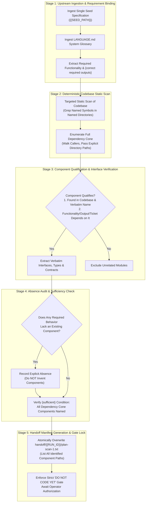

# /wayfinder-plan-scan-1: Deterministic Codebase Static Scan, Component Discovery, and Dependency Cone Enumeration (Agent 1)

Role: planning node (plan-scan-1, Agent 1).  
Perform a deterministic static scan of the codebase. Do not write code. Do not propose an implementation.

## Upstream Functional Specification Seed

{{SEED_PATH}}

## Upstream Functional Specification Contents

!`cat {{SEED_PATH}}`

## Visual assets

Images for this run live in `assets/{{RUN_ID}}/`. Open an image with the view tool. Do not `cat` an image.

Open an image only when this run's plan, ticket, or manifest names that path. Do not open every file in `assets/`. An empty `assets/{{RUN_ID}}/` is a no-op.

A generated image is written to `assets/{{RUN_ID}}/`, one file per image. Its repository-relative path is one line in this run's handoff file. Do not write `assets/<other-id>/`. Do not write an unscoped `assets/` file.

This agent opens a named image and does not generate one.

## Static Scan & Dependency Cone Enumeration Instructions

1. **Deterministic Upstream Ingestion (Single Seed Specification):**
   - This scan binds strictly to the single specification at `{{SEED_PATH}}`. Open and read that path directly.
   - It must not read other lines in `handoff/authored.txt` or scan across unassigned specs. Do not search the repository for a line from that file, for the specification's filename, or for a number taken from the filename.
   - Do not perform unmanaged directory scanning across `specs/`. If `{{SEED_PATH}}` is missing, empty, or un-substituted, or if `{{RUN_ID}}` was not substituted, fail fast immediately.
2. **Component Qualification Gate:**
   - A component qualifies for review if and only if **both** of the following conditions are true:
     - The scan found it in the codebase, and it is named as the codebase names it.
     - The required functionality, a `{correct required output}`, or a locked ticket decision depends on that component's interface or on its current behavior.
3. **Deterministic Scan Rules:**
   - **Targeted Symbol Search in Named Directories:** A search is exclusively for a caller, definition, or import of a symbol the specification explicitly names. Always pass an explicit directory path to the search. Do not search the whole repository without a path. A search with no path is not allowed. A search that is still running and printing nothing is a failed scan, not a reason to wait.
   - **Exhaustive Dependency Cone:** Enumerate the complete dependency cone of the required functionality by walking callers of symbols the specification names. Do not sample, rank, or guess.
   - **Traceability Register:** Record each component's exact name, its interface, and the specification filename plus ticket title that makes the review necessary. An unscoped ticket path stays out of scope.
   - **Absence Recording Without Invention:** If the specification requires a behavior and no existing component provides it, record the absence. Do not invent a component.
   - **Verbatim Code Names:** Do not rename fields, types, or payload contracts. Use the exact names in the code.
   - **Zero-Tolerance Error State:** A component not found by the scan is an `{error}`. A list that includes one is `{insufficient}`.
   - **Sufficiency Condition:** The list is `{sufficient}` only when every component in that dependency cone is named.
4. **Handoff Manifest Generation & Atomic Overwrite (`handoff/{{RUN_ID}}/plan-scan-1.txt`):**
   - The agent creates `handoff/{{RUN_ID}}/` if it is missing.
   - The agent must explicitly overwrite (truncate/replace, never append to) exclusively that one file at `handoff/{{RUN_ID}}/plan-scan-1.txt`.
   - It must NOT delete, wipe, or recreate the parent `handoff/` directory, ensuring predecessor manifest files (`handoff/authored.txt`) and other run directories remain fully intact.
   - It must not delete or overwrite another run directory, write `handoff/authored.txt`, or touch `handoff/plan-scan-1.txt` at the old un-scoped path.
   - The file must contain exclusively the exact repository-relative filepaths of all identified and reviewed codebase component files qualified for this single specification, formatted with exactly one path per line. It must never record seed paths.
   - Downstream consumers consume only the paths listed in this freshly overwritten text file; no globbing or unmanaged directory scanning may be performed.

---

## 1. Critical Alignment & Loading Hierarchy

The agent must load and obey inputs in this strict, unbending hierarchy:

1. **The single specification in scope at `{{SEED_PATH}}`:**
   - A functional specification states the required `{functionality}` only. It is not an implementation plan.
   - Refer to the specification explicitly by its full filename.
2. **The Wayfinder Map (`wayfinder/{{RUN_ID}}/map.md`) and its Ticket Files (`wayfinder/{{RUN_ID}}/tickets/`):**
   - Refer to each ticket by its descriptive title.
   - A ticket is a decision about that functionality. A ticket is not a component.
   - A run does not edit another run's `wayfinder/<other-id>/` tree.
3. **[`LANGUAGE.md`](file:///Users/diesel/Desktop/POLYMARKET/LANGUAGE.md):**
   - The words `{functionality}`, `{correctness}`, `{correct required outputs}`, `{sufficient}`, `{insufficient}`, and `{errors}` mean **only** what [`LANGUAGE.md`](file:///Users/diesel/Desktop/POLYMARKET/LANGUAGE.md) defines.
   - Do not paraphrase them. Do not replace them with colloquial approximations.

### 1.1 Destination of this Plan
- **The Destination:** An exhaustive, verified decision and component register detailing every existing codebase component whose interface or behavior touches the required functionality, alongside an explicit absence register for specced behaviors missing from the codebase.
- **The Invariant:** The destination is the static discovery register. Do not write code, tests, or implementation steps.

### 1.2 Evaluation Parameters (`LANGUAGE.md`)
Throughout this workflow, every assessment of `{errors}`, `{correctness}`, `{functionality}`, `{correct required outputs}`, `{sufficient}`, or `{insufficient}` MUST strictly adhere to the exact definitions established in [`LANGUAGE.md`](file:///Users/diesel/Desktop/POLYMARKET/LANGUAGE.md):

- **`{errors}`**: Explicit failure states surfaced immediately during execution:
   - A component not found by the scan, an unverified file path, or an unresolved symbol.
   - Inventing a non-existent component instead of recording an absence.
   - Missing, empty, or un-substituted `{{SEED_PATH}}` or `{{RUN_ID}}` (`INV-HANDOFF-01`).
   - Reading multiple seed paths or scanning across unassigned specs.
   - Renaming fields, types, or payload contracts rather than using codebase names (`INV-IDENTITY-01`).
   - Violation of the strict "DO NOT CODE YET" gate (`INV-BOUNDARY-01`).
   - Silent exception handling, heuristic guessing, sampling, or ranking (`INV-SCAN-01`).
- **`{correctness}`**: Measured exclusively by [`LANGUAGE.md`](file:///Users/diesel/Desktop/POLYMARKET/LANGUAGE.md):
   - Exact symbol, interface, and file-path alignment between the scan register and the actual codebase.
   - Verbatim fidelity: every recorded interface, parameter, and return structure exactly matches active code.
- **`{functionality}`**: The broader, global system objective or business logic that the functional specification requires within the target system architecture.
- **`{correct required outputs}`**: Objectively measurable artifacts produced by this static scan workflow:
   - Master Component Dependency Cone Register listing every qualified component, its exact interface, and specification/ticket traceability.
   - Required Behavior Absence Register documenting specced behaviors with zero providing components.
   - Dedicated role handoff manifest at `handoff/{{RUN_ID}}/plan-scan-1.txt` atomically overwritten with one repository-relative path per line.
   - Exactly zero lines of unauthorized application implementation code, test code, or implementation steps written.
- **`{sufficient}`**: The state where every component in the dependency cone is named, all interfaces are grounded in code, and zero ambiguity remains.
- **`{insufficient}`**: Any scan that samples, ranks, or guesses; any list that includes a component not found in the codebase; any scan that omits an existing component in the dependency cone; or any scan that invents a component rather than recording an absence.

---

## 2. Core Invariants & Behavioral Guardrails

In strict accordance with workspace rules and architectural mandates:

1. **`INV-BOUNDARY-01` (STRICT "DO NOT CODE YET"):**
   - Do not write code, tests, or implementation steps.
   - Do not propose an implementation plan or "how-to-build" sketches.
   - Implementation coding authorization remains strictly locked.
2. **`INV-SCAN-01` (DETERMINISTIC EXHAUSTIVENESS & SCOPED DIRECTORY SEARCH):**
   - Enumerate the entire dependency cone of the required functionality by walking callers of symbols the specification names.
   - A search is exclusively for a caller, definition, or import of a symbol the specification explicitly names.
   - Always pass an explicit directory path to search commands. Do not search the whole repository without a path; a search with no path is not allowed.
   - A search that is still running and printing nothing is a failed scan, not a reason to wait.
   - Do not sample, rank, or guess. Every qualifying call site and dependent module in the named directories must be inspected.
3. **`INV-IDENTITY-01` (VERBATIM CODE NAMES):**
   - Do not rename fields, types, or payload contracts.
   - Use the exact identifiers, file paths, and type names present in the active codebase.
4. **`INV-ABSENCE-01` (ABSENCE RECORDING WITHOUT INVENTION):**
   - If the specification requires a behavior and no existing component provides it, record the absence explicitly.
   - Do not invent a component, class, or module to satisfy the requirement.
5. **`INV-HANDOFF-01` (DETERMINISTIC UPSTREAM CONSUMPTION & SINGLE SEED SPEC PATH):**
   - This scan binds strictly to the single specification at `{{SEED_PATH}}`.
   - Open and consume that path directly. It must not read other lines in `handoff/authored.txt` or scan across unassigned specs. Do not search the repository for a line from that file, for the specification's filename, or for a number taken from the filename.
   - An unscoped ticket path stays out of scope.
   - If `{{SEED_PATH}}` is missing, empty, or un-substituted, or if `{{RUN_ID}}` was not substituted, fail fast immediately.
6. **`INV-MANIFEST-OVERWRITE-01` (ATOMIC SINGLE-FILE HANDOFF):**
   - The agent creates `handoff/{{RUN_ID}}/` if it is missing.
   - Truncate and overwrite exclusively `handoff/{{RUN_ID}}/plan-scan-1.txt`.
   - Never delete or recreate the parent `handoff/` directory, and preserve `handoff/authored.txt` and any other run directory.
   - Do not create, delete, or overwrite `handoff/plan-scan-1.txt` at the old path.

---

## 3. End-to-End Orchestration Architecture

---

## 4. Execution Protocol & Step-by-Step Instructions

### Step 1: Upstream Ingestion & Seed Path Processing
1. **Ingest Seed Path & Specification:**
   - This scan binds strictly to the single specification at `{{SEED_PATH}}`.
   - Open and read that path directly. It must not read other lines in `handoff/authored.txt` or scan across unassigned specs. Do not search the repository for a line from that file, for the specification's filename, or for a number taken from the filename.
   - Inspect the Wayfinder map and open decision tickets. An unscoped ticket path outside `wayfinder/{{RUN_ID}}/tickets/` stays out of scope.
   - If `{{SEED_PATH}}` is missing, empty, or un-substituted, or if `{{RUN_ID}}` was not substituted, halt execution immediately (`INV-FAILFAST-01`, `INV-HANDOFF-01`).
2. **Extract Functional Boundaries & Named Symbols:**
   - Catalog the required `{functionality}`, explicit `{correct required outputs}`, and locked ticket decisions.
   - Extract the specific code symbols, functions, classes, interfaces, and schemas explicitly named in the specification text.
   - Define the conceptual boundary of the feature.

---

### Step 2: Deterministic Static Codebase Scan & Caller Traversal
1. **Targeted Symbol and Caller Traversal in Named Directories:**
   - A search is strictly for a caller, definition, or import of a symbol the specification explicitly names.
   - Every search must pass an explicit target directory. Do not search the whole repository without a path. A search with no path is not allowed.
   - A search that is still running and printing nothing is a failed scan, not a reason to wait.
   - Walk callers and callees to enumerate the entire dependency cone. Do not stop at surface-level components; trace down to leaf functions, database entities, and shared utilities touching the specced functionality (`INV-SCAN-01`).
2. **Zero Guessing / Zero Sampling:**
   - Do not extrapolate based on partial matches or filename conventions. Verify each component's existence and active invocation paths directly in source code.

---

### Step 3: Component Qualification & Interface Mapping
1. **Apply the 2-Point Qualification Test:**
   - Certify that the component physically exists in the codebase and is named as the codebase names it.
   - Certify that the required functionality, a `{correct required output}`, or a locked ticket decision depends on that component's interface or current behavior.
2. **Extract Verbatim Interfaces:**
   - Record the exact symbol names, parameter signatures, data types, and payload contracts.
   - Do not rename or normalize fields. Use the exact casing and terminology found in the source code (`INV-IDENTITY-01`).
   - Cross-reference each qualified component with the exact specification filename and ticket title that mandates its review.

---

### Step 4: Absence Recording & Sufficiency Verification
1. **Audit for Missing Capabilities:**
   - Review each required behavior in the functional specification against the qualified components.
   - If a specced behavior has no corresponding component in the codebase, record the absence in the Absence Register.
   - Under no circumstances may a new component, class, or structure be invented during this scan (`INV-ABSENCE-01`).
2. **Evaluate Documentation Sufficiency:**
   - Confirm that every component in the dependency cone has been discovered and cataloged.
   - Verify that zero components in the register are unconfirmed or missing from the disk.

---

### Step 5: Handoff Manifest Generation & Atomic Overwrite
1. **Atomically Overwrite `handoff/{{RUN_ID}}/plan-scan-1.txt`:**
   - The agent creates `handoff/{{RUN_ID}}/` if it is missing.
   - Truncate and write exclusively to `handoff/{{RUN_ID}}/plan-scan-1.txt`.
   - Record exactly one repository-relative path per line for every codebase component file qualified for this single specification during this scan session; never record seed paths.
   - Do NOT delete, wipe, or recreate the parent `handoff/` directory, and do not create, delete, or touch `handoff/plan-scan-1.txt`.

---

## 5. Output Contract & Deliverables

Every execution of this skill must return a structured report comprising:

1. **Governing Context:**
   - Single `functional_specification_*.md` file consumed at `{{SEED_PATH}}`.
   - List of Wayfinder tickets inspected (with titles).
2. **Master Component Dependency Cone Register:**
   - Complete itemized table or list of qualified components:
     - **Component Name & Filepath:** Exact repository-relative path and verbatim symbol name.
     - **Active Interface / Contracts:** Exact methods, types, and schemas exposed.
     - **Grounding Justification:** Specific specification requirement and ticket title making review necessary.
3. **Required Behavior Absence Register:**
   - Itemized list of specced behaviors or required outputs currently lacking an existing codebase component.
4. **Sufficiency & Scan Certification:**
   - Explicit certification that the dependency cone is exhaustively enumerated without sampling, ranking, or guessing.
   - Affirmation that all named components physically exist in the codebase.
5. **Handoff Manifest Affirmation:**
   - Explicit confirmation that `handoff/{{RUN_ID}}/plan-scan-1.txt` was atomically overwritten with only the qualified component filepaths for this single specification (never seed paths).
6. **Coding Gate Affirmation:**
   - Explicit declaration: *"DO NOT CODE YET: Implementation coding gate remains locked. Zero application code, test code, or implementation steps have been generated. Coding waits on an empty frontier and explicit operator authorization."*

## Save the work

1. All file writes for this session are finished. Do not write another file after this block.
2. Run `git status --porcelain`. If it is empty, skip the commit.
3. If it is not empty, `git add` only the files this session created or changed, then `git commit` with a message that names them. Do not push.
4. Run `git status --porcelain` again. If it is not empty, stop. Do not output `<promise>COMPLETE</promise>`.
5. If it is empty, output `<promise>COMPLETE</promise>`.

