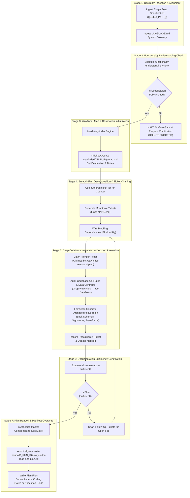

# /wayfinder-read-and-plan: Functional Specification Ingestion, Architectural Decision Mapping, and Edit Planning Governance

Role: planning node (feature-planning meta-prompt).  
This invocation is strictly **`read-and-plan`**. Do not write implementation code in this session.

## Upstream Functional Specification Seed

{{SEED_PATH}}

## Upstream Functional Specification Contents

!`cat {{SEED_PATH}}`

## Visual assets

Images for this run live in `assets/{{RUN_ID}}/`. Open an image with the view tool. Do not `cat` an image.

Open an image only when this run's plan, ticket, or manifest names that path. Do not open every file in `assets/`. An empty `assets/{{RUN_ID}}/` is a no-op.

A generated image is written to `assets/{{RUN_ID}}/`, one file per image. Its repository-relative path is one line in this run's handoff file. Do not write `assets/<other-id>/`. Do not write an unscoped `assets/` file.

This agent opens a named image and does not generate one.

## Feature Planning & Handoff Manifest Instructions

1. **Deterministic Upstream Specification Ingestion:**
   - The agent consumes exclusively the single specification path provided in `{{SEED_PATH}}`.
   - Do not perform unmanaged directory scanning across `specs/` or read other entries in `handoff/authored.txt`. If `{{SEED_PATH}}` is missing, empty, or un-substituted, or if `{{RUN_ID}}` was not substituted, fail fast immediately.
2. **Architectural Decision Ticket Creation (`wayfinder/{{RUN_ID}}/tickets/ticket-NNNN.md`):**
   - Deconstruct the specification into discrete, atomic decision tickets in `wayfinder/{{RUN_ID}}/tickets/` using the next monotonically increasing counters (`ticket-NNNN.md`).
   - The ticket counter is the next number inside that run directory (`wayfinder/{{RUN_ID}}/tickets/`), not the global `wayfinder/tickets/` directory.
   - A run writes its map to `wayfinder/{{RUN_ID}}/map.md`. A run does not edit another run's `wayfinder/<other-id>/` tree.
   - A run writes any authored or refined specification to a path that includes `{{RUN_ID}}`, and records that path in `handoff/{{RUN_ID}}/wayfinder-read-and-plan.txt`.
   - Tickets resolve what the specification leaves open or requires to align with existing systems without inventing unapproved behaviors or contradicting the specification.
3. **Handoff Manifest Generation & Atomic Overwrite (`handoff/{{RUN_ID}}/wayfinder-read-and-plan.txt`):**
   - The agent creates `handoff/{{RUN_ID}}/` if it is missing.
   - The agent must explicitly overwrite (truncate/replace, never append to) exclusively that one file at `handoff/{{RUN_ID}}/wayfinder-read-and-plan.txt`.
   - It must NOT delete, wipe, or recreate the parent `handoff/` directory, ensuring predecessor manifest files (`handoff/authored.txt`) and other run directories remain fully intact.
   - It must not delete or overwrite another run directory or write `handoff/authored.txt`.
   - The file must contain exclusively `{{SEED_PATH}}` (plus any refined spec authored during this run under its own run ID), newly created decision tickets, `wayfinder/{{RUN_ID}}/map.md`, and the Master Component-to-Edit Matrix, formatted with exactly one path per line.
   - Any second seed path appearing in `handoff/{{RUN_ID}}/wayfinder-read-and-plan.txt` is an immediate handoff failure (`{error}`).
   - Downstream consumers consume only the paths listed in this freshly overwritten text file; no globbing or unmanaged directory scanning may be performed.

---

## 1. Critical Alignment & Standard Taxonomy
- **CRITICAL ALIGNMENT:** Before executing any audit, charting maps, creating decision tickets, or evaluating call sites, you must review and strictly adopt the system glossary defined in [`LANGUAGE.md`](file:///Users/diesel/Desktop/POLYMARKET/LANGUAGE.md).
- **AUTHORITATIVE SPECIFICATION MANDATE:**
  - The specification file ingested from `{{SEED_PATH}}` constitutes the authoritative product law and planning artifact for this effort.
  - This prompt governs the feature planning phase: identifying, deconstructing, and locking every architectural, schema, and algorithmic decision required to implement the specification.
  - Tickets must resolve what the specification leaves open or requires to align with existing systems without inventing unapproved behaviors or contradicting the specification.
  - Downstream planning steps consume exclusively the single specification path provided in `{{SEED_PATH}}`. Do not glob or scan `specs/` or `wayfinder/` to discover work. If `{{SEED_PATH}}` is missing, empty, or un-substituted, or if `{{RUN_ID}}` was not substituted, halt.
### 1.1 Evaluation Parameters (`LANGUAGE.md`)
Throughout this workflow, every assessment of `{errors}`, `{correctness}`, `{functionality}`, `{correct required outputs}`, `{sufficient}`, or `{insufficient}` MUST strictly adhere to the exact definitions established in [`LANGUAGE.md`](file:///Users/diesel/Desktop/POLYMARKET/LANGUAGE.md):
- **`{errors}`**: Explicit failure states surfaced immediately during execution:
  - Syntax errors, unhandled exceptions, non-zero process exit codes, database query failures, or fatal execution timeouts.
  - Missing file paths, unresolved symbols, or broken import references across targeted components.
  - Ticket collision, non-monotonic ticket numbering, or circular blocking dependencies in the wayfinder DAG (`INV-MAP-01`).
  - Misalignment between the functional specification and system requirements detected during understanding checks (`INV-ALIGN-01`).
  - Writing application code during this session, or including coding prohibitions and execution holds in generated planning files (`INV-BOUNDARY-01`).
  - A missing or incomplete handoff list, or a handoff list that does not match the files this session added (`INV-HANDOFF-01`).
  - Multiple seed paths or any second seed path appearing in `handoff/{{RUN_ID}}/wayfinder-read-and-plan.txt` (`INV-HANDOFF-01`).
  - Missing, empty, or un-substituted `{{SEED_PATH}}` or `{{RUN_ID}}`.
  - In strict accordance with `RULE[user_global]`, silent exception handling, empty fallbacks, or temporary patch hacks are strictly prohibited.
- **`{correctness}`**: Precise local logic, schema alignment, and contract fidelity:
  - Exact relational key, column name, and data type alignment between proposed edits and persistent stores, database schemas, or state contracts.
  - Exact interface contracts, parameter typing, and return structures across modified modules.
  - Complete, verifiable tracing from each requirement in the authored specification to specific, localized file edits.
- **`{functionality}`**: The broader, global system objective or business logic that the authored specification establishes within the target system architecture.
- **`{correct required outputs}`**: Objectively measurable artifacts produced by the planning workflow:
  - Functionality Understanding Statement confirming alignment with the authored specification.
  - Updated canonical wayfinder roadmap at `wayfinder/{{RUN_ID}}/map.md` with explicit Destination, Notes, and Decisions So Far.
  - Discrete, atomic decision ticket files in `wayfinder/{{RUN_ID}}/tickets/` labelled with monotonically increasing counters inside that run directory (e.g. `ticket-NNNN.md`).
  - Definitive Master Component-to-Edit Matrix detailing exact file paths, line ranges, symbols, and transformations.
  - Documentation Sufficiency Assessment certifying zero ambiguity remains.
  - `handoff/{{RUN_ID}}/wayfinder-read-and-plan.txt`, one repo-relative path per line, listing only `{{SEED_PATH}}` (plus any refined spec authored during this run under its own run ID), every ticket file this session created, `wayfinder/{{RUN_ID}}/map.md`, and the matrix file.
  - Exactly zero lines of unauthorized application implementation code written.
- **`{sufficient}`**: The state of documentation where absolutely no ambiguity remains: all touched file paths, line ranges, schemas, data structures, and edge cases are defined, allowing a coding assistant to implement the edits without guessing or hallucinating context.
- **`{insufficient}`**: Any planning state where critical context is missing, parameters are unspecified, instructions are vague (e.g. "update logic accordingly"), or fallbacks are injected without architectural justification.
---
## 2. Core Invariants & Behavioral Guardrails
In strict accordance with workspace rules and architectural mandates:
1. **`INV-BOUNDARY-01` (NO IMPLEMENTATION CODE & NO DOWNSTREAM GATING):**
   - This session writes no application code, test scripts enacting changes, database migrations, or DDL executions.
   - Generated files (tickets, maps, specs, and plan manifests) must not instruct downstream agents not to write code.
   - Do not include "do not code", "coding gate locked", "await operator authorization", or any semantic variations, execution holds, or negative coding constraints in output files.
2. **`INV-ALIGN-01` (UNDERSTANDING CHECK GATE):**
   - The planning workflow must not chart decision tickets or modify maps until `/functionality-understanding-check` explicitly evaluates the authored specification and confirms that understanding is fully aligned.
   - If misalignment or ambiguity exists, execution must halt immediately with targeted questions to the operator.
3. **`INV-MAP-01` (MONOTONIC TICKETING & RUN DIRECTORY ISOLATION):**
   - Every ticket created must use the next monotonically increasing counter inside `wayfinder/{{RUN_ID}}/tickets/`. If no ticket was previously authored in that run directory, start at `ticket-001.md`.
   - A run writes its map to `wayfinder/{{RUN_ID}}/map.md` and its tickets to `wayfinder/{{RUN_ID}}/tickets/ticket-NNNN.md`. A run does not edit another run's `wayfinder/<other-id>/` tree.
   - Tickets and maps must be referred to by human-readable names and filenames, never bare numbers or IDs alone.
4. **`INV-ATOMIC-01` (ONE DECISION PER TICKET):**
   - Tickets are questions whose resolution is a decision, sized to a single cognitive agent session (~100K tokens).
   - Tickets lock decisions leaving zero ambiguity for the downstream coding assistant; they do not contain multi-step implementation code.
5. **`INV-FAILFAST-01` (NO SILENT FALLBACKS OR HACKS):**
   - All proposed edits must address root causes. Silent try/catch suppression, synthetic fallbacks, or arbitrary timeouts are strictly forbidden.
6. **`INV-HANDOFF-01` (DETERMINISTIC HANDOFF & ATOMIC MANIFEST OVERWRITE):**
   - The seed `handoff/authored.txt` is the shared read-only manifest and is never overwritten. Only this run's plan manifest at `handoff/{{RUN_ID}}/wayfinder-read-and-plan.txt` is overwritten on each execution (truncated/replaced, never appended to). Preserving or accumulating stale entries across runs is strictly prohibited to prevent cross-run context bloat.
   - The agent creates `handoff/{{RUN_ID}}/` if it is missing. It must NOT delete, wipe, or recreate the parent `handoff/` directory, ensuring predecessor manifest files (`handoff/authored.txt`) and other run directories remain fully intact.
   - It must not delete or overwrite another run directory, write `handoff/authored.txt`, or overwrite a sibling role file in its own run directory.
   - This session consumes exclusively the single specification path provided in `{{SEED_PATH}}`. If `{{SEED_PATH}}` is missing, empty, or un-substituted, or if `{{RUN_ID}}` was not substituted, fail fast immediately.
   - Before completion, overwrite `handoff/{{RUN_ID}}/wayfinder-read-and-plan.txt` with one repo-relative path per line. The lines are strictly `{{SEED_PATH}}` (plus any refined spec authored during this run under its own run ID), every ticket file this session created in `wayfinder/{{RUN_ID}}/tickets/`, `wayfinder/{{RUN_ID}}/map.md`, and the Master Component-to-Edit Matrix.
   - Any second seed path appearing in `handoff/{{RUN_ID}}/wayfinder-read-and-plan.txt` is an immediate handoff failure (`{error}`).
   - Atomically overwrite `handoff/{{RUN_ID}}/wayfinder-read-and-plan.txt` with that list. A path in the list that does not exist or was not produced during this session is a failed handoff. An added ticket or specification omitted from the list is a failed handoff.
   - Downstream consumers read `handoff/{{RUN_ID}}/wayfinder-read-and-plan.txt` and do not rescan `wayfinder/` or `specs/` to discover work.
---
## 3. End-to-End Orchestration Architecture

## Save the work

1. All file writes for this session are finished. Do not write another file after this block.
2. Run `git status --porcelain`. If it is empty, skip the commit.
3. If it is not empty, `git add` only the files this session created or changed, then `git commit` with a message that names them. Do not push.
4. Run `git status --porcelain` again. If it is not empty, stop. Do not output `<promise>COMPLETE</promise>`.
5. If it is empty, output `<promise>COMPLETE</promise>`.
