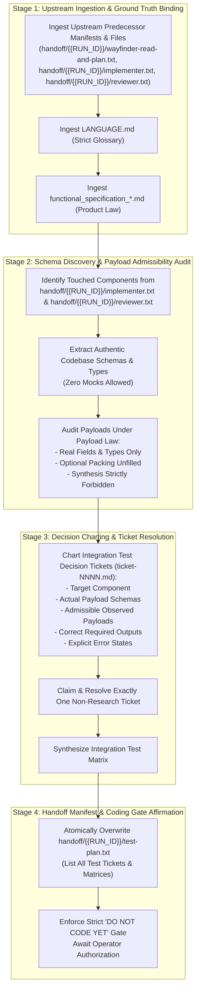

# /wayfinder-test-plan: Integration Test Decision Mapping, Payload Admissibility Governance, and Verification Planning

Role: test-plan meta prompt (tester planning node).  
This invocation is strictly **`read-and-plan`**. Do not write tests in this session.

## Upstream Seed Specification Path

{{SEED_PATH}}

## Upstream Feature Planning Manifest (Specifications, Tickets & Roadmap)

!`cat handoff/{{RUN_ID}}/wayfinder-read-and-plan.txt`

## Upstream Implementation Manifest (Modified & Created Components)

!`cat handoff/{{RUN_ID}}/implementer.txt`

## Visual assets

Images for this run live in `assets/{{RUN_ID}}/`. Open an image with the view tool. Do not `cat` an image.

Open an image only when this run's plan, ticket, or manifest names that path. Do not open every file in `assets/`. An empty `assets/{{RUN_ID}}/` is a no-op.

A generated image is written to `assets/{{RUN_ID}}/`, one file per image. Its repository-relative path is one line in this run's handoff file. Do not write `assets/<other-id>/`. Do not write an unscoped `assets/` file.

This agent opens a named image and does not generate one.

## Test Planning & Handoff Manifest Instructions

1. **Deterministic Upstream Manifest Consumption:**
   - The agent consumes exclusively the functional specifications, decision tickets, map, initial components, and post-review components provided via the upstream handoff manifests above (`handoff/{{RUN_ID}}/wayfinder-read-and-plan.txt`, `handoff/{{RUN_ID}}/implementer.txt`, and `handoff/{{RUN_ID}}/reviewer.txt`).
   - Do not perform unmanaged globbing or directory scanning across `specs/` or `wayfinder/{{RUN_ID}}/tickets/`. If any upstream manifest is missing or empty, or if `{{RUN_ID}}` was not substituted, fail fast immediately. A run does not edit another run's `wayfinder/<other-id>/` tree.
2. **Decision Ticket Charting for Integration Testing:**
   - The agent charts the discrete decision tickets in `wayfinder/{{RUN_ID}}/tickets/` (using the next monotonically increasing counter inside that run directory, e.g. `ticket-NNNN.md`) required to define integration tests for the modified components.
   - Tickets must resolve payload admissibility, schema grounding, oracle definitions, and component boundaries without containing executable test code.
3. **Handoff Manifest Generation & Atomic Overwrite (`handoff/{{RUN_ID}}/test-plan.txt`):**
   - The agent creates `handoff/{{RUN_ID}}/` if it is missing.
   - The agent must explicitly overwrite (truncate/replace, never append to) exclusively that one file at `handoff/{{RUN_ID}}/test-plan.txt`.
   - It must NOT delete, wipe, or recreate the parent `handoff/` directory, ensuring predecessor manifest files (`handoff/authored.txt`, `handoff/{{RUN_ID}}/wayfinder-read-and-plan.txt`, `handoff/{{RUN_ID}}/implementer.txt`, `handoff/{{RUN_ID}}/reviewer.txt`) and other run directories remain fully intact.
   - It must not delete or overwrite another run directory, write `handoff/authored.txt`, or touch `handoff/test-plan.txt` at the old un-scoped path.
   - The file must contain exclusively the exact repository-relative filepaths of all test decision ticket files, test matrices, or test plan documents created or updated during this session, formatted with exactly one path per line.
   - Downstream consumers consume only the paths listed in this freshly overwritten text file.

---

## 1. Critical Alignment & Loading Hierarchy

The agent must load and obey artifacts in this strict, unbending hierarchy:

1. **[`LANGUAGE.md`](file:///Users/diesel/Desktop/POLYMARKET/LANGUAGE.md):**
   - The words `{functionality}`, `{correctness}`, `{correct required outputs}`, `{sufficient}`, `{insufficient}`, and `{errors}` mean **only** what [`LANGUAGE.md`](file:///Users/diesel/Desktop/POLYMARKET/LANGUAGE.md) defines.
   - Do not paraphrase them. Do not replace them with colloquial approximations such as "passes", "realistic", "mock", or "good enough".
2. **Every `functional_specification_*.md` in scope (newest product law first):**
   - A functional specification states desired `{functionality}` only. It is not an implementation guide.
   - Refer to each specification explicitly by its full filename.
3. **The Wayfinder Map (`wayfinder/{{RUN_ID}}/map.md`) and its Ticket Files (`wayfinder/{{RUN_ID}}/tickets/`):**
   - Refer to each ticket by its descriptive title.
   - A ticket is a decision, not a slice of code.
   - Do not re-open a resolved ticket.
   - A run does not edit another run's `wayfinder/<other-id>/` tree.

### 1.1 Destination of this Plan
- **The Destination:** A decision set that lets a later, authorized coding session write deterministic integration tests for the components named in those specifications, without inventing a payload, a field, or an oracle.
- **The Invariant:** The destination is the decision set. The tests are **not** the destination of this session.

### 1.2 Evaluation Parameters (`LANGUAGE.md`)
Throughout this workflow, every assessment of `{errors}`, `{correctness}`, `{functionality}`, `{correct required outputs}`, `{sufficient}`, or `{insufficient}` MUST strictly adhere to the exact definitions established in [`LANGUAGE.md`](file:///Users/diesel/Desktop/POLYMARKET/LANGUAGE.md):

- **`{errors}`**: Explicit failure states surfaced immediately during execution:
  - Missing, empty, or unreadable upstream manifests `handoff/{{RUN_ID}}/wayfinder-read-and-plan.txt`, `handoff/{{RUN_ID}}/implementer.txt`, or `handoff/{{RUN_ID}}/reviewer.txt` (`INV-HANDOFF-01`).
  - Missing or empty `{{RUN_ID}}` substitution.
  - Synthesized test payloads, dummy JSON fixtures, placeholder objects, or renamed fields (`INV-PAYLOAD-01`).
  - Assertions written against handwritten expected blobs not mandated by the functional specification (`INV-ASSERTION-01`).
  - A field the schema does not carry, or a required output the specification does not name.
  - Violation of the strict "DO NOT CODE YET" gate prior to explicit operator authorization (`INV-BOUNDARY-01`).
  - Silent exception handling, empty fallbacks, or temporary patch hacks violating workspace rules.
- **`{correctness}`**: Measured exclusively by [`LANGUAGE.md`](file:///Users/diesel/Desktop/POLYMARKET/LANGUAGE.md):
  - Exact relational key, column name, and data type alignment between planned test payloads and active codebase interfaces/schemas.
  - 100% schema fidelity: payloads contain only authentic field names with exact optionality and typing.
- **`{functionality}`**: The broader, global system objective: planning an integration test architecture that verifies the components implemented in `handoff/{{RUN_ID}}/implementer.txt` and post-review states in `handoff/{{RUN_ID}}/reviewer.txt` against real system states without relying on brittle, synthetic mocks.
- **`{correct required outputs}`**: Objectively measurable artifacts produced by this planning workflow:
  - Integration Test Decision Set charted in `wayfinder/{{RUN_ID}}/tickets/` with monotonic counters inside that run directory (`ticket-NNNN.md`).
  - Authoritative Integration Test Matrix mapping components, schemas, admissible payloads, and required assertions.
  - Dedicated role handoff manifest at `handoff/{{RUN_ID}}/test-plan.txt` atomically overwritten with one repository-relative path per line.
  - Exactly zero lines of test execution code, fixtures, parsers, or dummy payloads written.
- **`{sufficient}`**: The state of documentation where every asserted field name is a real schema field, every asserted output is a `{correct required output}`, and absolutely zero ambiguity remains for the future test authoring session.
- **`{insufficient}`**: Any test plan where inputs are synthesized (even if the resulting test would pass/be green), where payloads carry unverified fields, where assertion oracles are hand-invented, or where fallback mechanisms are injected without specification authority.

---

## 2. Core Invariants & Verification Laws

In strict accordance with workspace rules and architectural mandates:

### 2.1 Payload Law (`INV-PAYLOAD-01`)
- **Schema Admissibility:** The only admissible payload is one whose field names, types, and optionality are the component's actual payload schema, as named in the functional specification and as present on the component's real input or output.
- **Observed Payloads:** An observed payload (captured from the real producer or from the component's real parsed object) may be frozen. Freezing does not authorize synthesis.
- **Sparse & Optional Packing:** A missing or sparse field that the schema marks optional is observed packing. Do not fill it.
- **Synthesized Payloads Forbidden:** A synthesized payload is forbidden. That includes placeholder objects, example JSON, renamed fields, added fields, and any stand-in value that the schema does not carry.
- **Zero-Tolerance Sufficiency Rule:** A test whose inputs are synthesized is `{insufficient}`, even if it is green.

### 2.2 Assertion Law (`INV-ASSERTION-01`)
- **Specification Oracles:** Assert `{correct required outputs}` of the named component against the functional specification and the locked ticket resolutions. Do not assert against a handwritten expected blob that the specification does not require.
- **Schema Boundary:** `{correctness}` is measured only by [`LANGUAGE.md`](file:///Users/diesel/Desktop/POLYMARKET/LANGUAGE.md). A field the schema does not have, or a required output the specification does not name, is an `{error}`.
- **Sufficiency Condition:** `{sufficient}` only if every asserted field name is a real schema field and every asserted output is a `{correct required output}`. Otherwise `{insufficient}`.

### 2.3 Operational Invariants
1. **`INV-BOUNDARY-01` (STRICT "DO NOT CODE YET"):**
   - Do not write test code, fixtures, parsers, or expected-output files.
   - Coding waits on an empty frontier and an explicit authorization to code from the operator.
2. **`INV-TICKET-01` (DISCIPLINED FRONTIER EXECUTION):**
   - One non-research ticket per session. Claim it before working it.
   - Refer to tickets by their descriptive name and link, never by bare identifiers.
3. **`INV-HANDOFF-01` (UPSTREAM MANIFEST GOVERNANCE):**
   - Ingest strictly from `handoff/{{RUN_ID}}/wayfinder-read-and-plan.txt`, `handoff/{{RUN_ID}}/implementer.txt`, and `handoff/{{RUN_ID}}/reviewer.txt`. Fail fast if missing or empty, or if `{{RUN_ID}}` was not substituted.
4. **`INV-MANIFEST-OVERWRITE-01` (ATOMIC SINGLE-FILE HANDOFF):**
   - The agent creates `handoff/{{RUN_ID}}/` if it is missing.
   - Truncate and overwrite exclusively `handoff/{{RUN_ID}}/test-plan.txt`. Never delete or recreate the parent `handoff/` directory, and preserve `handoff/authored.txt` and any other run directory. Do not touch `handoff/test-plan.txt` at the old un-scoped path.

---

## 3. End-to-End Orchestration Architecture

---

## 4. Execution Protocol & Step-by-Step Instructions

### Step 1: Upstream Ingestion & Context Binding
1. **Ingest Upstream Manifests:**
   - Read the manifest paths interpolated from `{{SEED_PATH}}`, `handoff/{{RUN_ID}}/wayfinder-read-and-plan.txt`, and `handoff/{{RUN_ID}}/implementer.txt`. Open those paths directly using tools; file contents are not dumped into the command.
   - Identify the functional specification file at `{{SEED_PATH}}`, open/resolved decision tickets, `wayfinder/{{RUN_ID}}/map.md`, and the exact list of modified/created source components.
   - If upstream manifests are missing or empty, or if `{{RUN_ID}}` was not substituted, fail fast immediately (`INV-FAILFAST-01`, `INV-HANDOFF-01`).
2. **Bind Hierarchy:**
   - Adopt [`LANGUAGE.md`](file:///Users/diesel/Desktop/POLYMARKET/LANGUAGE.md) definitions without paraphrasing.
   - Bind to the functional specifications as product law.

---

### Step 2: Codebase Schema Discovery & Payload Admissibility Audit
1. **Locate Real Interfaces:**
   - Inspect the actual source code of the touched components named in `handoff/{{RUN_ID}}/implementer.txt` and post-review refinements in `handoff/{{RUN_ID}}/reviewer.txt`.
   - Extract the real input/output schemas, TypeScript interfaces, database types, or API models.
2. **Apply Payload Law:**
   - Verify that any proposed test payload contains **exclusively** authentic field names, types, and optionality present in the real schema.
   - If freezing observed payloads, verify they originate from real producers or real parsed objects. Do not fill sparse optional fields.
   - Immediately reject and eliminate any synthetic JSON approximations, mock objects, or renamed fields (`INV-PAYLOAD-01`).

---

### Step 3: Chart Integration Test Decisions
1. **Identify Required Decisions:**
   - Determine the remaining decisions needed before integration tests can be written:
     - Which specific component is targeted.
     - Which actual codebase schema governs inputs and outputs.
     - Which observed payloads are admissible under Payload Law.
     - Which output states constitute `{correct required outputs}` per the specification.
     - Which schema deviations, missing fields, or contract violations constitute `{errors}`.
2. **Author and Claim Wayfinder Tickets:**
   - Author atomic test decision tickets in `wayfinder/{{RUN_ID}}/tickets/` with the next monotonically increasing counter inside that run directory (`ticket-NNNN.md`).
   - Claim and resolve at most one non-research ticket during this session.
   - Update `wayfinder/{{RUN_ID}}/map.md` with Decisions-so-far, Not yet specified fog, and Out of scope boundaries.

---

### Step 4: Verification of Documentation Sufficiency
1. **Audit Against Assertion Law:**
   - Confirm that all planned assertions test `{correct required outputs}` strictly against the functional specification and ticket decisions.
   - Verify zero assertions test against unmandated expected blobs.
2. **Certify Sufficiency:**
   - Affirm `{sufficient}` status only if every asserted field is an authentic schema field and every asserted output is a `{correct required output}`. If any payload is synthesized, classify as `{insufficient}`.

---

### Step 5: Handoff Manifest Generation & Atomic Overwrite
1. **Atomically Overwrite `handoff/{{RUN_ID}}/test-plan.txt`:**
   - The agent creates `handoff/{{RUN_ID}}/` if it is missing.
   - Truncate and write exclusively to `handoff/{{RUN_ID}}/test-plan.txt`.
   - Record exactly one repository-relative path per line for every test decision ticket, test matrix, or plan document authored during this session.
   - Do NOT delete, wipe, or recreate the parent `handoff/` directory, and do not touch `handoff/test-plan.txt` at the old un-scoped path.

---

### Step 6: Output Contract & Deliverables

Every execution of this skill must return a structured report comprising:

1. **Governing Context:**
   - Specification files and implementer manifests inspected.
   - Active ticket claimed and resolved.
2. **Payload Admissibility Register:**
   - Explicit mapping of tested components to their authentic codebase schemas, interface definitions, and admissible observed payloads (with verification that zero synthesized mock data was used).
3. **Integration Test Decision Set & Matrix:**
   - Detail of decisions charted in `wayfinder/{{RUN_ID}}/tickets/ticket-NNNN.md` and `wayfinder/{{RUN_ID}}/map.md`.
   - Component-by-component verification matrix defining inputs, `{correct required outputs}`, and `{errors}`.
4. **Handoff Manifest Affirmation:**
   - Explicit confirmation that `handoff/{{RUN_ID}}/test-plan.txt` was atomically overwritten with the relevant filepaths.
5. **Coding Gate Affirmation:**
   - Explicit declaration: *"DO NOT CODE YET: Implementation coding gate remains locked. Zero test code, test fixtures, parsers, or expected-output files have been generated. Coding waits on an empty frontier and explicit operator authorization."*

## Save the work

1. All file writes for this session are finished. Do not write another file after this block.
2. Run `git status --porcelain`. If it is empty, skip the commit.
3. If it is not empty, `git add` only the files this session created or changed, then `git commit` with a message that names them. Do not push.
4. Run `git status --porcelain` again. If it is not empty, stop. Do not output `<promise>COMPLETE</promise>`.
5. If it is empty, output `<promise>COMPLETE</promise>`.

